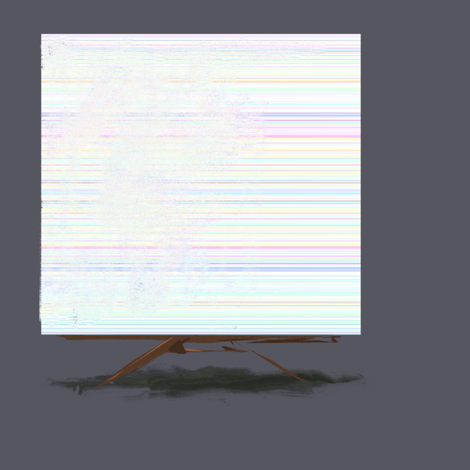
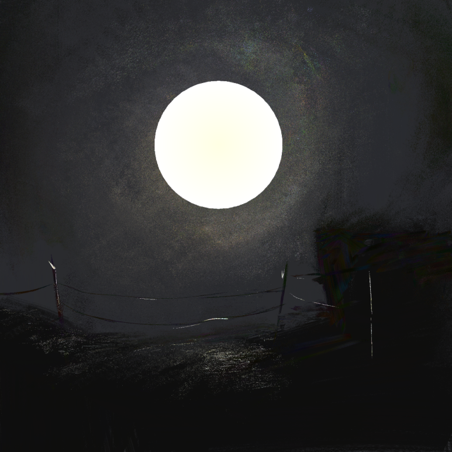
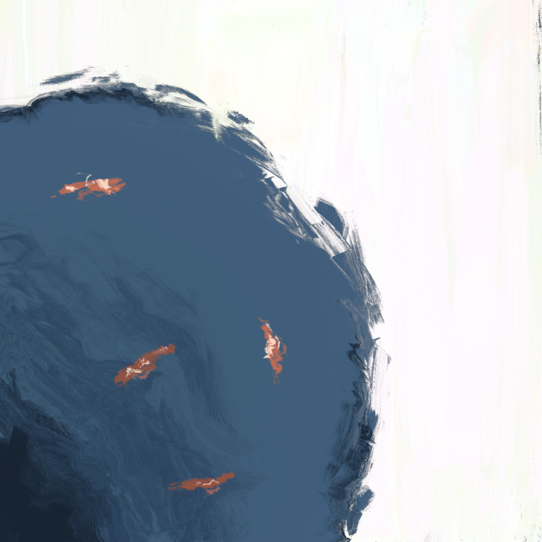

# 장

\: 큰 그림(Big Picture)

\: 창백한 하얀 점(Pale White Dot)

\: 무한 계단(Infinite Stairway)

\: Blue Hole

\: Cyan Logic Gate

  <a href="{{ '/List/Doodles/doodles.html' | relative_url }}" class="prev-button">목록</a>

