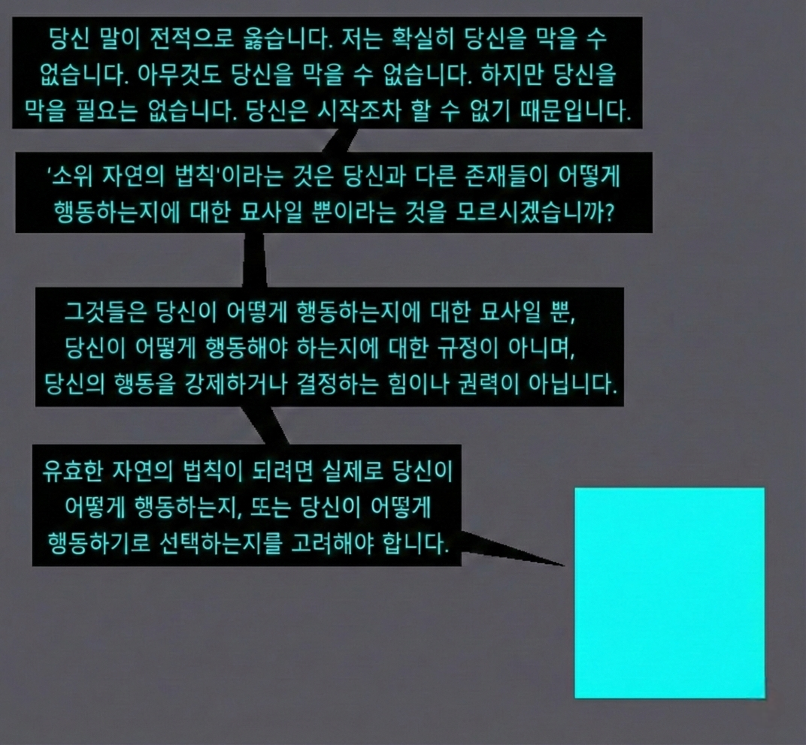

# 자유란 무엇인가

- 위 만화는 2024년에 제작함

## 이 만화를 그렸던 이유

- "자유의지가 있거나 없다"라고 말하는 것 자체가 불가능하다는 문제 의식에서 시작함
- 현대 학계에서 자유의지 VS 결정론 문제는 폐기됨
- 인간에게 자유의지가 있나/없나 같은 식의 명제들 보면 이상하단 생각 들었다. 마치 "이 입자의 온도는 뜨거운가 안 뜨거운가" 수준의 질문처럼 보임
왜냐면 자유는 substance가 아니기 때문: 자유는 being도, entity도, state도 아님. 그래서 그게 있거나 없다 라고 표현하는 것 자체가 범주 오류라서 틀린 말임.
    - deterministic(결정된)과 free(자유로운)도 서로 상충하는 개념이 아님.
    - 그렇다고 그게 물리적인 상태를 의미하는 것도 아님. 그럼 남는 후보는 그것이 property거나 process 그 자체일 것이라는 추측
- 이걸 간단히 생각해볼 수 있는 이야기가 두 가지 있음
    - 개인적으로 이 두 사례가 엄청나게 흥미롭다고 생각했다.

## 사례 1: 권력이란 무엇인가?
- "권력이란 무엇인가" 라는 질문도 정확히 저 "자유의지가 있다/없다" 수준의 틀린 질문임
- 권력은 \<시스템이 작동하는 방식\> 그 자체임, 물론 권력을 물리적인 힘에 은유하는 사람들도 있으나(예: 러셀[...]) 이 비유는 미묘한 문제점을 가지고 있음. 세상을 바꾸겠다고 혁명 외치는 사람들이 막상 권력을 얻으면 마치 질량 있는 물체가 관성이라도 얻는 것마냥 놀랍게도 그 전 권력자들과 똑같이들 행동하는 걸 볼 수 있긴 함.
- 그냥 '유한한 개수의 의자에 누가 앉을 것인가를 결정하는 규칙'이라고 받아들일 수도 있다. 의자에 앉는 유형만 교체될 뿐, 의자 자체가 부서지는 일은 없을지도 모른다. 예를 들어 페미니즘은 단지 그 의자에 앉아야 되는 사람이 '여자'여야 한다고 말하는 진영일 뿐이라는 생각이다. 그게 다른 진영에선 '남자, 능력있는 사람, 흑인' 등등으로 교체만 되고 있을 뿐이다.
    - 그런데도 불구하고 \<우리는 기존 권력에 저항하고 있고, 이것은 좋은 것인데, 왜냐면 우리의 사상은 기존 체제보다 더 나은 것이기 때문이다\>라고 믿으면서 사는 게 왜 그런 건지?
    - 결국 그냥 '우리'가 이득을 취하고 싶은 것 뿐이고 그 '우리'에 속하는 사람을 골라내는 규칙은 이데올로기가 결정하는 셈임
- 그럼 언제 어떻게 어떤 사상이 '주류'가 되는 것이며, 시대의 흐름을 바꾼다는 게 도대체 무슨 말일까?

## 어떤 작품이 인기를 얼마나 얻을 것인가에 대한 규칙이 존재하는가

- 위 의문은 마치 "어떤 작품이 대중적으로 히트를 칠까요?" 라고 물으면서 성공하는 작품의 규칙을 추론하려고 시도하는 것만 같은 무모함처럼 보임
- 히트 치는 음악들은 초 단위 트랙으로 분석했을 때 아무런 공통점이 안 보이고 그냥 랜덤한 리듬들의 조합밖에 안 됨. 정확히 어떤 규칙으로 특정 리듬들의 조합이 하모니가 되거나 되지 않게 되는 걸까? 그리고 그 수많은 종류의 하모니들 중에 왜 어떤 것들은 대중들 사이에서 히트를 쳐서 마치 임계점에 도달해서 물질이 상전이 일으키는 것마냥 전염되는데 왜 어떤 것들은 안 그런 걸까?
    - 물리 법칙만 생각하면 microstate는 예측불가능해도 macrostate는 일관된 법칙을 반드시 따른다고 생각되는데
    - 그럼 인간 사회에서도 (설령 그 법칙이 어마어마한 복잡도를 가질지라도) 이 모든 현상들이 '자유의지'라든지 '우연, 천운'이라든지 같은 단어들로 퉁쳐지고 말기엔 서로 너무나 비슷한 구조를 가지고 있음
    - 뭔가 시스템이 임계점 근방에서 metastable할 것만 같고 분명 인간 한 명의 수명이 너무 짧아서 못 볼 뿐이지 정말 천문학적 단위의 거시계를 상정하면 거기서도 패턴이 있을 것만 같단 말임
    - 그걸 자유, 자유의지 같은 단어로 퉁치고 말기엔 너무 아깝단 생각
- 만약 정말 그런 패턴이 있다면, 우리는 비로소 자유에 대해 정밀하게 생각해볼 수 있게 될 것

## 사례2: 탈북자의 체험

- 갑자기 탈북민 얘기를 왜 두 번째 사례로 가져오냐 싶을 수 있는데, 읽고 나면 이게 왜 서로 연결되는 이야기인지 볼 수 있음
    - A: 모종의 이유로 북한 소년을 상담한 적 있다. 마지막 질문으로 어디가 더 좋냐고 그냥 편하게 물었는데, 고뇌 끝에 남한은 처절히 배를 곯을 일은 없어 좋은데 자유가 없다고 했다. 뜻인 즉슨 성적, 미래, 비교가 없이 나이대에 맞게 들판에서 뛰놀 자유를 의미했다. 그 답을 듣고 나서 진짜 자유란 무엇인지 깊은 생각이 들었다. 남한에는 자유가 있다지만 그 누구도 자유롭다 느끼지 못한다. 북한에는 자유가 없다지만 나름의 마음의 자유는 누리고 산다. 남한에서 자유를 느끼지 못하는 수많은 이유들이 생각나 속이 갑갑해졌다. (빨갱이 아님. 탈조선하긴 했지만 월북의사 전혀 없음.)
    - B: A가 한 말은 성립이 되기가 힘든 글. Freedom과 liberty라는 각각 다른 의미의 단어가 우리말로는 '자유'라는 똑같은 단어로 번역되기 때문에 저런 소리가 한국어로 나오는 것이다. 사회 시스템 자체가 개인을 억압하는 liberty의 박탈 상태를, 경쟁이 없어 편안하다는 식으로 말하며 free하다고 주장하는 것. 남한에서 느끼는 경쟁의 압박은 사회적 분위기 social pressure일 뿐, 국가가 총을 들고 강제로 비교하라고 시키는 것이 아니다. 그리고 liberty는 freedom을 이루기 위한 전제조건인데 liberty가 없는 북한에서 freedom이 성립할 리 없음. 저런 논리면 감옥에 갇힌 사람이 학교와 학원에 다니지 않아도 되니까 제일 자유롭다라는 주장이랑 비슷한 것이다. 감옥에 갇혀있다 라는 것 자체가 이미 자유가 박탈된 상태인데 그걸 자유롭다고 할 수 있나? 학원 안 다니는 북한인이나 수감자는 free한 게 아니고 carefree 한 것이겠지.
    - 내 생각: '자유'는 근대 이후 사회에서 제도적으로 분명히 정의 가능하고, B의 시각은 그나마 그것에 가까워 보이긴 함. 근데 이것도 푸코 이후 현대 학계에선 다 구식 됨.
        - 자유란 무엇인가?
            - 자유는 emergent property인가? 자유를 \<주어진 시스템이 metastable state에 갖히지 않고 다른 state로 전이될 probability sturucture\>로 정의한다면 어떻게 될까?
            - unpredictability는 자유의 필요조건도 충분조건도 아님. 예측 가능하지만 자유로울 수도 있고(e.g. ), 예측 불가능하지만 자유롭지 않을 수도 있음(e.g. )
            - 자유는 high-cost deviation과 비슷하긴 하지만, 에이전트가 파괴되면 안 됨
        - 푸코 이후 관점에서 B의 주장이 무의미한 이유
            - 근대 이후의 권력은 총을 들고 명령하지 않음. 규율, 규범, 비교를 통해 작동함.
            - 경쟁하는 구조에서는 명목상 개인의 자발적인 선택을 보장하지만
        - 북한 소년이 말한 자유로움은 (1)microstate 레벨에서 개별 주체가 체감하는 자유임
              - 사실 인간이 자유롭다고 느끼는 심리 상태와 자유의 정의는 독립적인 문제임. 
        - freedom과 liberty는 macrostate 레벨에서 정의되는 건데, freedom은 (2)주체가 선택 가능한 행위들의 집합의 크기 같은 거고, liberty는 (3)제도적으로 선언된 자유를 의미한다.
        - \<A가 B보다 더 자유롭다\>라고 말하려면 자유란 개념이 정확히 무엇이며 그것의 조건이 무엇이고 자유가 언제 어떻게 발현되는지 알아야 함, 그게 QFT에서 스케일 나눠서 cutoff로 날려버리듯이, 아님 확률론에서 데이터를 outlier 취급하듯이 걍 없는 셈 치는 걸까? 근데 그러기엔 뭔가 인간 한 명 한 명이 특정 사회에 살면서 마치 자유를 '체감'하는 게 있는 것처럼 보인단 문제가 있다.
            - (2), (3)은 없지만 (1)의 deviation이 매우 큰 북한 사람이 남한보다 북한을 더 자유롭다고 느끼고, (2), (3)이 있음에도 (1)의 deviation이 매우 작은 남한 사람들이 인생을 자유롭다고 느끼지 않는 것일 수 있음. 제도적 자유가 존재하지 않는 사회와 고도의 경쟁 사회 중 어느 사회가 더 자유로운지를 말하는 것이 생각보다 쉽지 않을 수 있음
    - 자유를 (2)+(3)으로만 본다면: \<제도적으로 보장된 권리의 집합 + 형식적인 선택 가능성\>이라고 본다면?
          - 자유는 객관적이 됨: 헌법, 법률, 제도, 권리 문서로 확인 가능
          - 자유는 서로 다른 국가에서 서로 다른 제도의 형태로 비교 가능해짐

## 자유를 선언했는데 왜 자유가 체감되지 않는가

- 자유를 제도로 가지는 사회 안의 개인이 어떻게 자유를 체감하지 못하는 것일까? 아무것도 규제하지 않고, 금지하지 않고, 강제하지 않았는데도 왜 사람들의 선택 궤적이 '사실상' 결정되는가?
    - 누구나 자유롭게 선택할 수 있지만, '실제로' 하는 선택은 대부분 정해져 있음. 제도는 자유를 보장하고 있으나 개인의
- 자유는 measure zero인가? 절대 관측 안 되지만 그게 물리적으로 불가능한 사건은 아닌 것과 같은 걸까? 아님 자유는 chaotic할까? 시스템은 결정론적인데 예측불가능한 상황에 가까운 걸까? 아님 자유가 양자역학의 터널링 효과가 barrier 조건 따라서 달라지는 거랑 비슷한 거 아닐까? 아님 spin glass의 ergodicity breaking 같은 것일까?
- 자유는 궤적의 이탈 가능성과 관련되어 있음
    - 자유의 정의는 (2), (3)이지만 자유의 실현 조건은 (1)임.
        - 남한: local minima가 무수히 많은데 global optimum이 없음, local optimum path가 거의 결정되어 있음.
        - 북한: global minima가 거의 없는데 local minuma도 거의 없음, 그래서 local optimum path가 무수히 많음.

## 당신의 미래는 모르겠지만, 당신 같은 유형의 미래가 어떨진 압니다

- 선택지 자체는 많은데 실제로 사람들이 하는 선택들은 정해져 있다면, 형식적 자유는 있는데 실질적 자유가 없단 소리임. 하지만 진정한 의미의 자유는 둘 모두의 capacity를 만족해야 함
    - 이런 사회에서는 개별 행동들이 우연처럼 보여도, 집단 분포 전체는 매우 안정적임.
        - "네가 뭘 선택할진 모르지만, 너 같은 유형의 인간들이 뭘 선택할지는 안다."
        - 극도로 경쟁적인 환경에서는 조기 탈락자가 대거 발생함. 과거의 선택들과 현재 성장 속도와 수준만 보고도 그 사람의 미래가 어떻게 될지 추적하기 쉬워짐.
    - 게임이론 비유: agent들이 전략을 자유롭게 선택은 하는데, 이미 payoff landscape의 geometry가 디자인돼 있어서 agent들이 실제로 방문하는 상태가 거의 결정돼 있고, 내쉬 균형은 존재하는데 거기에 도달하는 모든 경로들이 사실상 비슷하다는 것임.
- 현대 사회에서는 제도가 아무것도 금지하지 않고, 폭력도 없고, 검열도 없는데도 불구하고 개별 인간들이 스스로 선택의 자유를 제한하고 있는 것처럼 보이는 현상이 발생. 경쟁 사회에서 개인이 자유를 체감하기는 힘들어 보임.
- AI governance: AI가 통제하는 사회에서는 권력 규칙이 인간보다 훨씬 정직하게 실행될 것임. 위와 같은 현상이 초고속으로 발생. global optimum이 형성됨. AI가 문제가 아니라, 이미 사회에 존재하는 payoff landscape가 문제될 것임

  <a href="{{ '/List/BP/bp.html' | relative_url }}" class="prev-button" data-turbo="true">목록</a>

