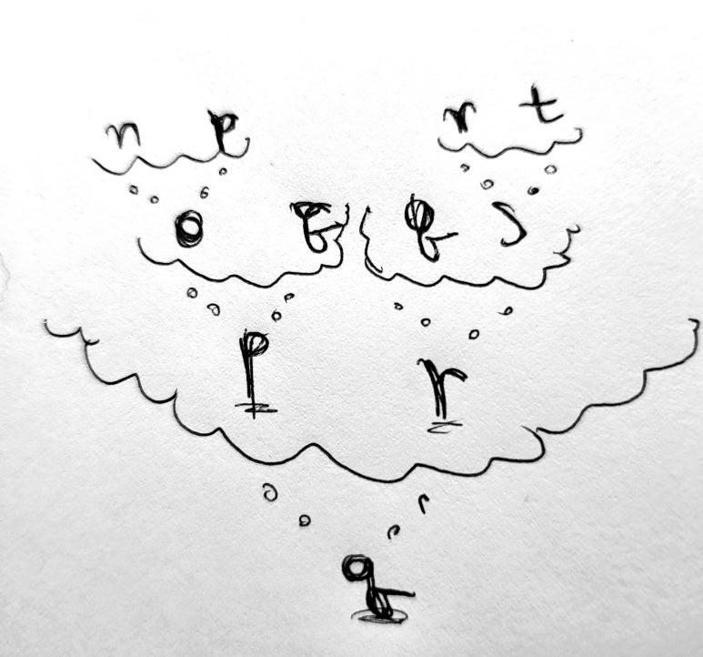

# 메타-메타-실재

자신을 뛰어넘은(meta-)체계의 너머를 인지하는 것이 구조적으로 가능할까요? 가능하다면 어떻게 구현될까요? 똑같은 차원에서, 사람은 자기 자신의 체계를 뛰어넘는 또다른(meta-)체계에 대해서 새로운 통찰을 할 수 있을까요? 혹은 이미 하고 있는 것일까요?   
그게 가능하다면, 그렇게 뛰어넘는 체계의 그 다음은(meta-meta)요? 그리고 그 다음은(meta-meta-meta)? 그러고 나면 또 그 다음은(meta-meta-meta-meta-···)? 그런 인지적 통찰의 규칙은 어디에서 발생할까요?   

의식은 어디에서 올까요? 자연에 대응해야 하는 체계에 불완전함이 존재한다면, 그건 그 체계의 근본적인 결함일까요? 메타논리가 직관적이라면, 인간의 의식은 근본적으로 중대한 결함을 가지고 있다고 보아야 할까요?  

사실 이 추측 속에는 중대한 함정이 있습니다만, 현재로선 한순간에 호도되기 어려울 것입니다.

  <a href="{{ '/List/Doodles/doodles.html' | relative_url }}" class="prev-button">목록</a>

