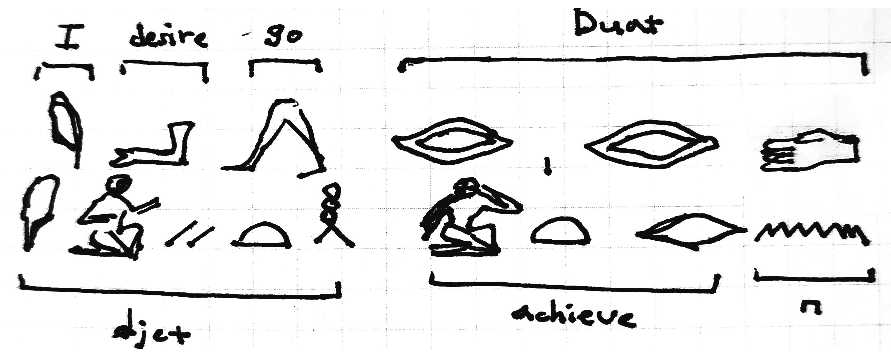

# 한 남자와 그의 영혼의 대화

고대 이집트인들은 죽음이 단순한 끝이 아니라 영생으로의 여정이라고 믿었다. 죽음 이후 영혼은 사후 세계(Duat)로 여행하는데, 죽음의 신인 오시리스 앞에서 최종 심판을 받은 후 영원한 안식을 얻을 수 있었다. Ma'at은 당대 문화의 핵심 개념으로 진리와 조화, 정의를 의미했으며, ma'at에 따라 산 자와 죽은 자의 삶이 평가되고 이를 따르지 않는 자는 영생을 누리지 못한다고 여겼다. 따라서 사후 세계에서 평온을 누리기 위해서는 생전에 철저한 준비가 필요했다.  
또 이들은 인간이 여러 요소로 구성되어 있다고 믿었으며, 육체와 영혼이 분리될 수 없다고 생각했다. 그래서 개인의 정체성과 영혼을 나타내는 ba, 생명력을 나타내는 ka, 영혼이 신과 동화되어 완전체가 된 akh라는 상징이 있었다.  

*한 남자와 그의 영혼의 대화*는 기원전 1937년에서 1759년 사이 이집트 중왕국 제12왕조 시기에 작성된 것으로 추정되는 고대 이집트의 교훈 문학 작품으로, 삶에 지친 한 남자가 자신의 바(ba)와 대화를 나누며 자살을 고려하는 내용을 담고 있다. 남자는 고통스러운 현실에 죽음을 택하고 사후 세계로 가고 싶다고 토로하지만 그의 영혼은 그를 반대한다. 논쟁 끝에 그들은 화해하여 남자는 삶을 지속하기로 결심한다. 이 작품은 삶의 고통과 죽음을 둘러싼 인간의 내면적 갈등을 다루고 있으므로 고대 문학으로선 보기 드문 사료라 할 수 있다.   

기원전 사람들도 살아가다 죽고 싶다는 생각을 했던 것을 보면, 그때나 지금이나 본질은 항상 똑같았던 것일지도 모른다.

----

[*Dialogue of a Man with His Ba*](https://ethicsofsuicide.lib.utah.edu/selections/egyptian-didactic-tale/)

[Fabricius](https://artsandculture.google.com/experiment/fabricius/gwHX41Sm0N7-Dw?hl=en)

[How did the Ancient Egyptians get to the Afterlife?](https://artsandculture.google.com/story/NgVRmUGP2E9yIg?hl=en)

  <a href="{{ '/List/Doodles/doodles.html' | relative_url }}" class="prev-button" data-turbo="true">목록</a>

