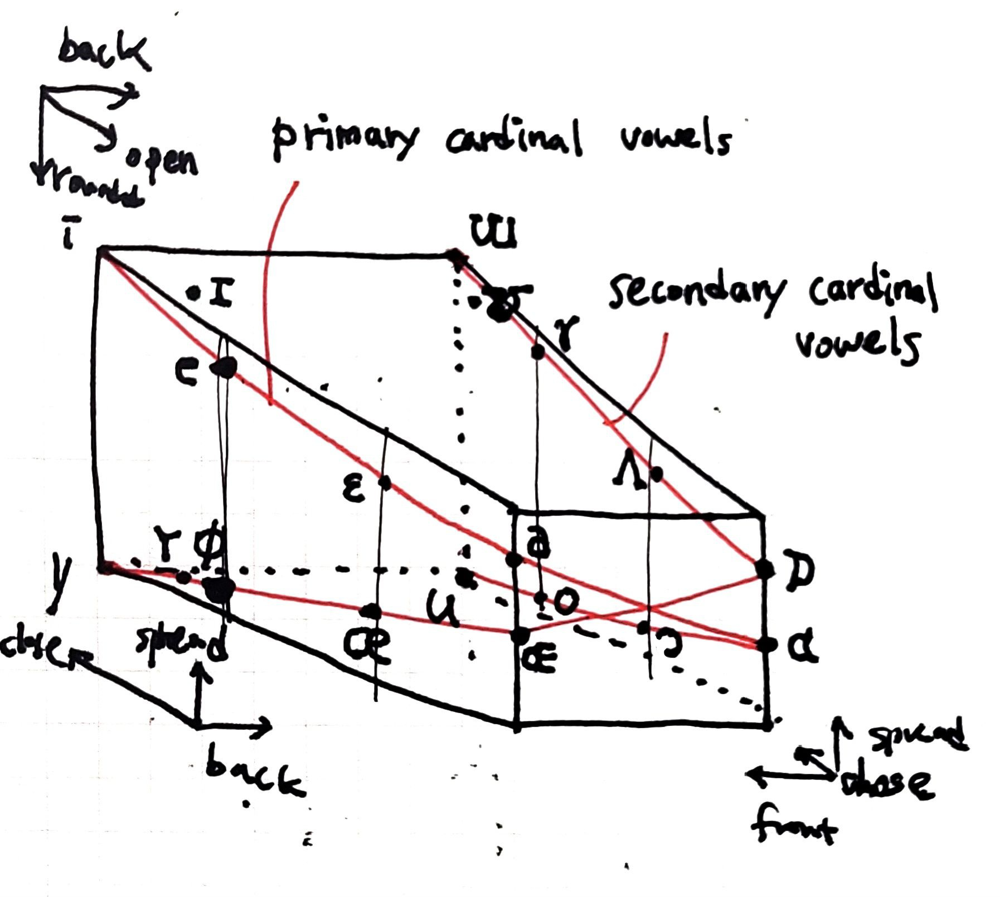

# 3차원 모음 다이어그램

Vowel Diagram은 모음을 혀의 위치와 입 모양에 따라 시각적으로 표현한 도표이다. 모음사각도(Vowel Quadrangle)는 모음 도표에서 가장 널리 사용되는 형태이며 2차원 사각형(주로 사다리꼴) 형태로 그려진다. 모음을 발음할 때 혀의 위치가 입 안에서 앞뒤(front/back)에 위치하는지, 입술이 둥글게 말려 있는지(round/unrounded), 혀가 입천장에 얼마나 가까운지(close/near-close/close-mid/open-mid/open-close/open), 입술이 옆으로 어떻게 퍼져 있는지(spread)에 따라 조음 특징이 구분된다.  
이 모음사각도를 3차원으로 확장하면 위 그림과 같이 그릴 수 있다. 빨간선은 각각 primary cardinal vowels와 secondary cardinal vowels를 이은 선이다. 각 선들 위의 모음이 두 개의 convex plane 상에 놓여져 있다는 것을 상상할 수 있다.

----
[Vowel diagram](https://en.wikipedia.org/wiki/Vowel_diagram)

[Vowel Theory](https://sail.usc.edu/~lgoldste/General_Phonetics/Vowels/Vowel_Theories.html)

*A Course in Phonetics*, P.Ladefoged

  <a href="{{ '/List/Doodles/doodles.html' | relative_url }}" class="prev-button">목록</a>

