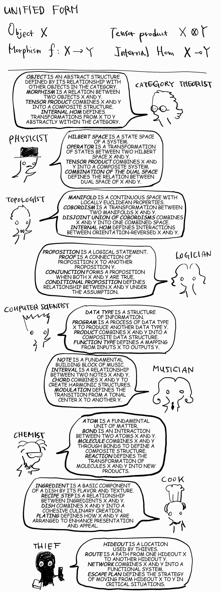

# 동형사상

로제타석은 과거 고대 이집트의 상형문자를 해독하는데 핵심적인 역할을 한 석비로, 같은 내용이 세 가지 언어로 기록되어 있습니다. 서로 다른 언어들이 본질적으로 동일한 의미를 공유하고 있다면 외국어를 일일이 배우지 않아도 그걸 모어로 번역하여 이해할 수 있을 것입니다.  
서로 다른 구조들이 본질적으로 동일한 수학적 틀을 공유하고 있다면 그중 하나를 이해함으로써 동형성을 가진 다른 시스템들까지 모두 이해할 수 있게 되는 걸까요? 논리학-수학-물리학-컴퓨터 과학의 연결고리가 단순한 유사성을 넘어 과학의 일반적인 과정 자체를 설명하는 하나의 통합된 틀이 될 수 있을까요? 혹은 그러기 위해서 어떻게 해야 할까요? 만약 일반 과학의 틀을 수학적으로 통일할 수 있다면 더 나아가서 사회와 경제의 구조까지 똑같은 방식으로 설명할 수 있는 걸까요?  
Category theory나 Homotopy type theory를 중심으로 하는 대표적인 시도들이 있습니다만, 이런 동형성이 실제로 얼마나 본질적이고 어떻게 확신 가능한지까지는 알 수 없으며, 이것들을 실질적으로 어떻게 응용해야 할지조차 오리무중입니다.

----
[*Physics, Topology, Logic and Computation:
A Rosetta Stone*](https://arxiv.org/abs/0903.0340v3)

  <a href="{{ '/List/Doodles/doodles.html' | relative_url }}" class="prev-button" data-turbo="true">목록</a>

