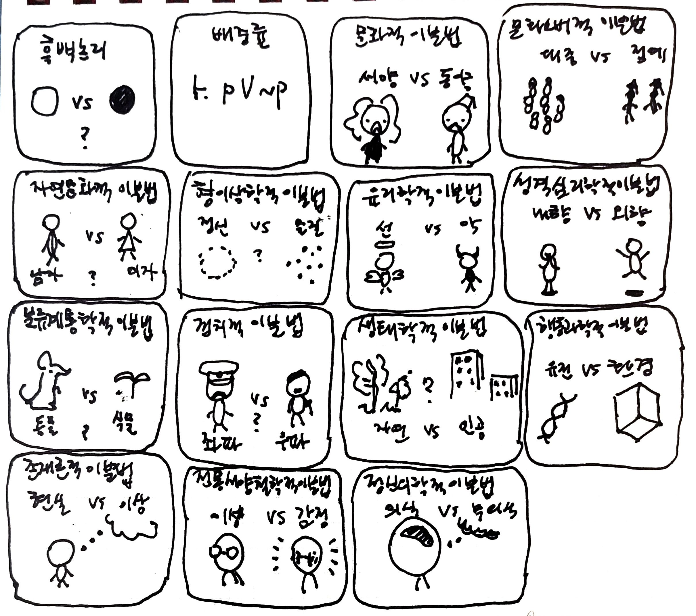

# 이분법

어떤 원소도 두 부분이 동시에 속하지 않으면서 두 부분으로 완전히 분할되도록 전체를 나누기:  
이분법적 사고는 단순히 두 부분으로 나누는 것을 넘어 복잡한 현상을 두 극단으로 단순화해 이해하기 위한 인류의 오래된 시도입니다. 단순한 것은 실용적이며 편리하지만 그만큼 설명에 한계가 존재합니다. 어떤 경우에서도 이분법에서 벗어나는 사례를 관찰할 수 있을 것입니다.  
현실에서 고전논리의 배중률을 위반하는 수많은 물리적 현상들([양자얽힘](https://en.wikipedia.org/wiki/Quantum_entanglement), [파동-입자 이중성](https://en.wikipedia.org/wiki/Wave%E2%80%93particle_duality), [모순허용논리](https://plato.stanford.edu/entries/logic-paraconsistent/)를 이용한 기계학습 등)을 관측할 수 있습니다. 서양과 동양을 무 자르듯 나누는 것은 과거 서구 제국주의의 전략이었으며([동서양 이분법](https://ko.wikipedia.org/wiki/%EB%8F%99%EC%84%9C%EC%96%91_%EC%9D%B4%EB%B6%84%EB%B2%95)), 대중과 엘리트의 경계가 희미해지고 있습니다(순수미술과 상업미술). 생물학적 관점에서 사람은 남자이면서 동시에 여자이거나, 남자도 여자도 아닐 수 있습니다.([간성](https://ko.wikipedia.org/wiki/%EA%B0%84%EC%84%B1_(%EC%84%B1)),[성별 불일치의 원인](https://en.wikipedia.org/wiki/Causes_of_gender_incongruence)) 데카르트적 사고관은 정신과 물질의 형이상학적 분리에 지나지 않습니다([심신문제](https://thereader.mitpress.mit.edu/discovery-mind-body-problem/)). 선과 악, 이성과 감성은 인간의 본성이라기보다는 윤리학과 심리학을 위해 만들어진 대립 관계입니다. 자연에는 동물도 아니고 식물도 아닌 생명체가 있으며, 사회 경제 문화적 현상은 두 극단의 정치 이념만으로 쉽게 나뉘지 않습니다([정치사상](https://en.wikipedia.org/wiki/List_of_political_ideologies)). 사람의 성격 또한 연속적인 스펙트럼에 가까우며([특성이론](https://ko.wikipedia.org/wiki/%ED%8A%B9%EC%84%B1%EC%9D%B4%EB%A1%A0)) 유전적 요인과 환경적 요인, 의식과 무의식은 서로 상호작용해 영향을 미칩니다([nature vs nurture](https://en.wikipedia.org/wiki/Nature_versus_nurture)).  
단순성의 미학을 과연 쉽게 포기할 수 있을까요? 물론, 이분법의 시선에 갇힌 질문에서 벗어난다면 분명 세상의 더욱 많은 현상들이 설명되긴 할 것입니다. 

---
[이분법에서 벗어나기](https://philonatu.com/blog/blog_view.php?id=346)

[Dichotomy](https://en.wikipedia.org/wiki/Dichotomy)

  <a href="{{ '/List/Doodles/doodles.html' | relative_url }}" class="prev-button">목록</a>

