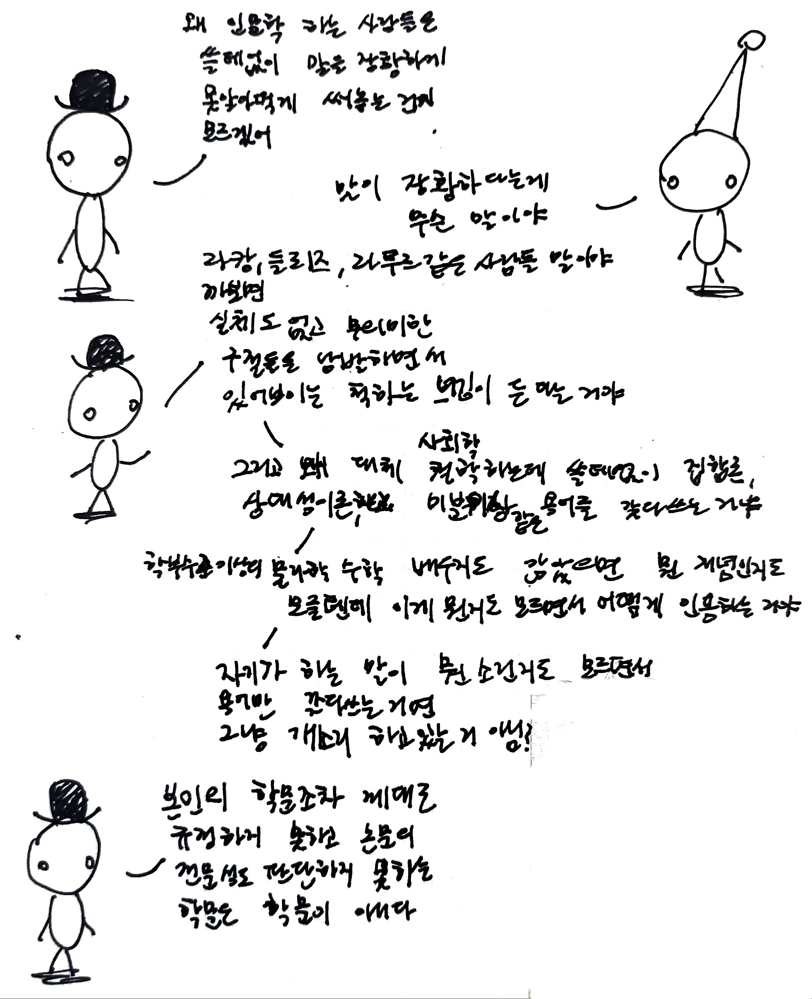
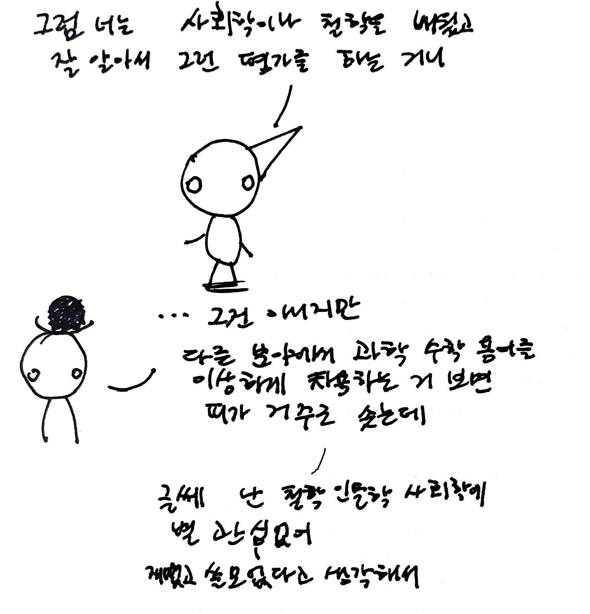
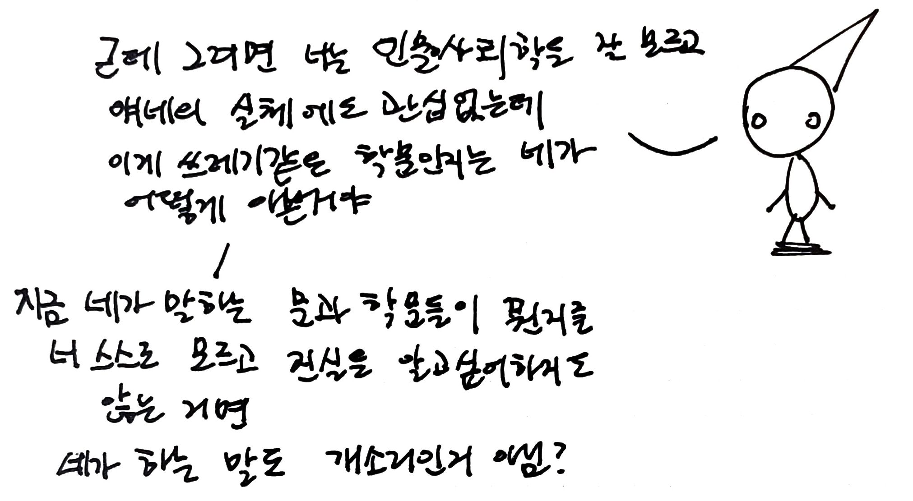

# 개소리

"누군가 자신이 진실을 안다고 생각하지 않는다면 그가 거짓말을 하는 것은 불가능하다. 개소리를 지어내는 데는 그러한 신념이 필요 없다. 따라서 거짓말을 하는 사람은 진리에 대해 반응한다. 그만큼 진리를 존중하는 셈이다. 정직한 사람이 말할 때, 그는 오직 자신이 참이라고 믿는 바를 말한다. 거짓말쟁이는, 이에 상응하게 자신의 발언이 거짓이라고 여기는 것이 필수불가결하다.  
그렇지만 개소리쟁이에게는 이 모든 것이 무효다. 그는 진리의 편도 아니고 거짓의 편도 아니다. 정직한 사람의 눈과 거짓말쟁이의 눈은 사실을 향해 있지만, 개소리쟁이는 사실에 전혀 눈길을 주지 않는다. 자신이 하는 개소리를 들키지 않고 잘 헤쳐 나가는 데 있어 사실들이 그의 이익과 관계되지 않는 한, 그는 자신이 말하는 내용들이 현실을 올바르게 묘사하든 그렇지 않든 신경 쓰지 않는다. 그는 그저 자기 목적에 맞도록 그 소재들을 선택하거나 가공해낼 뿐이다."  
*개소리에 대하여*, 해리 프랭크퍼트  

---

프랭크퍼트는 개소리의 본질을 "*진술이 참이라는 믿음에 근거하고 있지 않으며, 그것이 참이 아니라는 믿음에 근거하고 있지도 않은*", 즉 진리에 대한 관심에 연결되어 있지 않다는 것, 사태의 진상이 실제로 어떠한지에 대한 무관심에 있다고 설명합니다.  
진리에 대한 존중과 신념이 있다고 하더라도, 이것이 반드시 개소리를 피하는 충분조건은 아닙니다. 진정성이 있다는 것 역시 개소리하기로부터 우리를 지켜주기에 충분한 보호막이 되지 못합니다. 누군가의 지식과 발언 내용 사이의 괴리는 개소리를 발생시키기 마련이겠지요. '진리'를 시대착오적인 낡은 개념으로 생각한다면 남은 선택지는 <침묵하거나, 계속해서 개소리만을 지껄이기>밖에 없을 것입니다...  
저는 살면서 얼마나 많은 개소리를 하고 있을까요?

  <a href="{{ '/List/Doodles/doodles.html' | relative_url }}" class="prev-button">목록</a>

