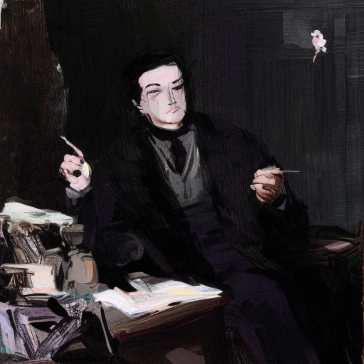

# LoRA-250607

앞의 두 그림은 EulerDiscreteScheduler, 나머지는 DDPMScheduler을 사용하여 생성한 그림이다. 

----

[Train a Diffusion Model](https://huggingface.co/docs/diffusers/tutorials/basic_training)

  <a href="{{ '/List/Doodles/doodles.html' | relative_url }}" class="prev-button" data-turbo="true">목록</a>

