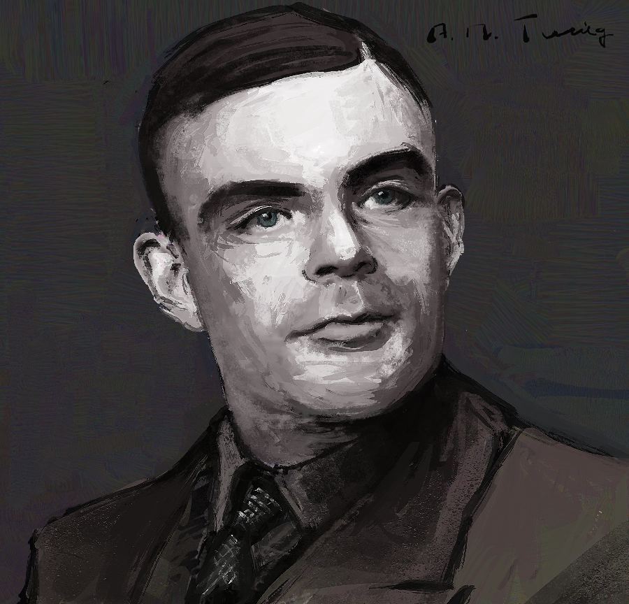

# 앨런 튜링 Alan Turing

(1912–1954) 

## 업적과 일생

- 현대 컴퓨터 과학과 인공지능의 선구자
- 컴퓨터 과학, 암호 해독, 생물학에 업적이 걸쳐 있으며 튜링 머신이라는 모델을 제안
- 알고리즘과 계산 가능성 이론의 기초를 마련
- 제2차 세계대전 중 영국 정부 암호 해독 기관에서 일하며 독일의 에니그마 암호를 해독해 전쟁 승리에 기여함
- 튜링 테스트를 제안
- 처치-튜링 테제
- 튜링 패턴
- 동성애 처벌로 인해 자살

----
[Legacy of Turing](https://en.wikipedia.org/wiki/Legacy_of_Alan_Turing)

  <a href="{{ '/List/Portrait/portrait.html' | relative_url }}" class="prev-button">목록</a>

