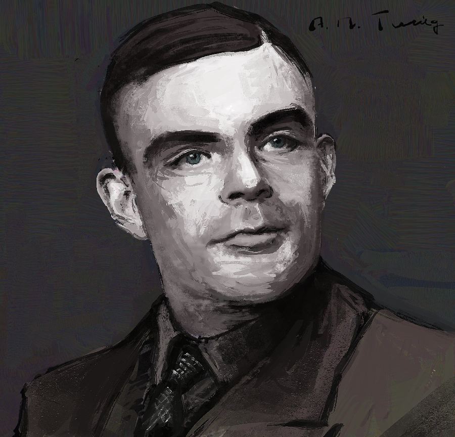

# 앨런 튜링 

  
  

    (1912–1954) 현대 컴퓨터 과학과 인공지능의 선구자. 컴퓨터 과학, 암호 해독, 생물학에 업적이 걸쳐 있으며 튜링 기계라는 모델을 제안. 알고리즘과 계산 가능성 이론의 기초를 마련. 제2차 세계대전 중 영국 정부 암호 해독 기관에서 일하며 독일의 에니그마 암호를 해독해 전쟁 승리에 기여함. 튜링 테스트를 제안. 동성애 처벌로 인해 자살로 생을 마감.
  

인간의 의식을 일련의 시스템으로 구사하는 작업은 기본적으로 마음이 뇌에서 기능한다는 생각에서 시작한다. 일단 몸-마음 문제가 거시적인 수준에서 ToM에 핵심이 되는 논의는 아니라고 여겨진다. 하지만 어느 의미에선 과격해 보이는 기능주의가 인공지능의 탄생을 야기했다는 사실은 추후에도 중요하게 작용할 것이다.  

이 글에서 잠시 언급할것은 인공지능의 아버지인 앨런 튜링이다. 그가 그와 같은 별칭으로 불리는 정사에는 아마도 짧은 일생동안 그가 저술한 논문들에서 인공지능이라는 개념이 창안된 것과 그 미래에 대한 거의 모든 예언을 적중시킨 놀라운 그의 통찰력에 있을 것이다. Intelligent Machinery에서 튜링은 다음과 같은 대분류 하에 인공지능이 활약되리라는 설명을 한다.

i) 게임 (ex. 체스, 틱택토, 브릿지, 포커 등)

ii) 언어 (ex. 문자화된 자연어 학습하기, 번역하기, 해독하기)

iii) 수학 (ex. 문제 풀기, 정리 증명하기, 기호 조작하기)

논문 투고 시기를 감안할 때, 80년이 지난 현재 대두되고 있는 인공지능의 학습 및 활약 분야를 다음과 같이 추가할 수 있다.

ii) +자연어를 듣고 이해하기, 식별하기. 소설, 시 등의 글짓기

iii) +(수학적으로)추리하기, 유추하기, 증명하기

iv) 시각자료 판단. (ex. 그림인식, 그림 그리기)

v) 작곡하기

튜링은 i), ii), iii) 순으로 인공지능 기술의 실현 가능성을 예측했다. 실제로 인공지능이 가장 먼저 대대적으로 활약하기 시작한 분야는 체스와 바둑을 비롯한 전략 게임이다. 2016년 이세돌 9단과의 대국에서 상대한 딥마인드(DeepMind)의 AlphaGo Lee버전의 하드웨어 성능은 이제 2019년에 개발된 AlphaZero나 2021년의 MuZero 버전 2를 대상으로는 1000분의 1 수준도 되지 않는다. 한편 iv)나 v)와 같은 예술 창작의 영역이 인간 고유의 영역이라는 고질적인 편견이 파괴되고 인공지능이 인간의 수준과 비견해지기 시작한 것은 아주 근래의 일이다.  

인공 신경망이 사용하는 딥러닝(DL)의 학습 전략 중 분산 모델(diffusion model)에는 여러 하위 모델들(DPM, NCSN, DDPM)이 있지만, 전체적으로는 모두 단 하나의 물리학적 영감에서 구현된 메커니즘이라고 할 수 있다. 비평형 열역학과 전자기역학에서의 확산 방정식(diffusion equation)이 그것이다. 흥미롭게도 이 이론은 복잡계 이론에서 동역학계의 확산 및 분기점(bifurcation)계산, 그리고 생물체의 표피 무늬 현상을 연구한 튜링의 반응-확산 시스템(reaction-diffusion system)에서 모두 구조적으로 유사한 미분방정식 꼴의 형태를 보인다. (튜링의 웬만한 업적들이 대부분 인공지능과 연결될 수 있다는 것에 상당한 신비로움을 느끼지 않을 수 없다!)  스티븐 울프람(Stephen Wolfram)의 A New Kind of Science에서는 튜링 머신을 2차원화한 셀룰러 오토마타(cellular automata)가 등장하는데, 셀(cell)메모리를 사용하는 인공 신경망 중에도 그처럼 튜링 머신을 모델화한 뉴럴 튜링 머신(NTM)이 존재한다.   

튜링 머신을 이용해 지능을 구현하는 생각은 기본적으로 '인간의 두뇌 작용을 겉보기로 모방하고, 그 모방체가 근본적으로 인간의 두뇌와 같은 작용을 하는' 논리를 따른다. encoder-decoder구조를 갖춘 DL은 인간의 학습 및 기억 구조를 시스템적으로 묘사하는 심리학의 기억 저장 이론과 동일한 구조를 갖추는 비선형 모델이기도 하다. DL의 상위집합인 머신러닝(ML)에서는 데이터 계산을 위한 사전·사후확률 갱신에 고전적 확률론인  베이즈 정리를 이용하는데, 이와 유사하게 양자 인지 이론(QMT)에서는 그를 보충한 안드레이 콜모고로프(Andrei Kolmogorov)의 이론을 이용해 양자 단위에서의 인지 메커니즘을 설명한다. 

ML의 기초 원리가 물리학과 심리학에서 영감을 얻는 것은, 우리가 그 과도기에서 직관적 발상 내지 통찰의 발견을 어느 정도까지 필요로 하게 될 것인지에 관한 어떤 실마리를 제시해 줄 것인가? 차차 두고 볼 일일 것이다.

  <a href="{{ '/List/SM/sm.html' | relative_url }}" class="prev-button">목록</a>

