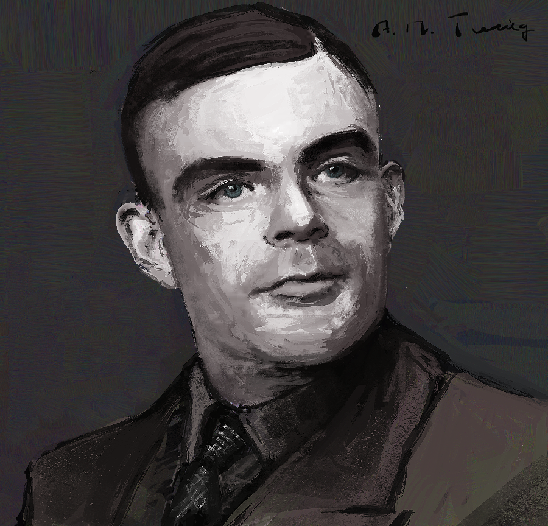

# 앨런 튜링 

인간의 의식을 일련의 시스템으로 구사하는 작업은 기본적으로 마음이 뇌에서 기능한다는 생각에서 시작한다. 일단 몸-마음 문제가 거시적인 수준에서 ToM에 핵심이 되는 논의는 아니라고 여겨진다. 하지만 어느 의미에선 과격해 보이는 기능주의가 인공지능의 탄생을 야기했다는 사실은 추후에도 중요하게 작용할 것이다. 머스크의 발언이 그와 관련된 조금 대중적인 예시 중 하나로 보인다.

1000조 비트 정도의 수준으로 추산되는 인간의 시냅스를 그대로 양자 비트로 치환한다면 무어의 법칙(Moore's Law)에 따라 컴퓨터 한 대의 성능은 나의 세대가 50대가 되는 2050~60년대쯤이 되면 지구상에 존재하는 인류 전체의 뇌 성능을 합한 수준과 같아진다(고 한다). 나는 이 예측을 별 의심의 여지 없이 믿을 수 있는 사람 중 하나라고 할 수 있다(아마도). 그렇기에 이 분야를 연구하는 사람으로서 결코 마르거나 가시지 않는 호기심을 가지면서도 한편으로는...모르겠다. 사람이 대부분의 삶을 공부에 투자한다면 그러한 지적 활동이 흥미 본위를 자극함과 동시에 지능ㅡ인간 지능을 발전시키고자 하는 목적에 있는 것이 아닌가. 한데 이것은 공부하면 할수록 이전까지의 느낌과는 차원이 다른 어떤 것이 느껴진다.

이 글에서 잠시 언급할것은 인공지능의 아버지인 앨런 튜링이다. 그가 그와 같은 별칭으로 불리는 정사에는 아마도 짧은 일생동안 그가 저술한 논문들에서 인공지능이라는 개념이 창안된 것과 그 미래에 대한 거의 모든 예언을 적중시킨 놀라운 그의 통찰력에 있을 것이다. Intelligent Machinery에서 튜링은 다음과 같은 대분류 하에 인공지능이 활약되리라는 설명을 한다.

i) 게임 (ex. 체스, 틱택토, 브릿지, 포커 등)

ii) 언어 (ex. 문자화된 자연어 학습하기, 번역하기, 해독하기)

iii) 수학 (ex. 문제 풀기, 정리 증명하기, 기호 조작하기)

논문 투고 시기를 감안할 때, 80년이 지난 현재 대두되고 있는 인공지능의 학습 및 활약 분야를 다음과 같이 추가할 수 있다.

ii) +자연어를 듣고 이해하기, 식별하기. 소설, 시 등의 글짓기

iii) +(수학적으로)추리하기, 유추하기, 증명하기

iv) 시각자료 판단. (ex. 그림인식, 그림 그리기)

v) 작곡하기

튜링은 i), ii), iii) 순으로 인공지능 기술의 실현 가능성을 예측했다. 실제로 인공지능이 가장 먼저 대대적으로 활약하기 시작한 분야는 체스와 바둑을 비롯한 전략 게임이다. 2016년 이세돌 9단과의 대국에서 상대한 딥마인드(DeepMind)의 AlphaGo Lee버전의 하드웨어 성능은 이제 2019년에 개발된 AlphaZero나 2021년의 MuZero 버전 2를 대상으로는 1000분의 1 수준도 되지 않는다. 한편 iv)나 v)와 같은 예술 창작의 영역이 인간 고유의 영역이라는 고질적인 편견이 파괴되고 인공지능이 인간의 수준과 비견해지기 시작한 것은 아주 근래의 일이다.  

인공 신경망이 사용하는 딥러닝(DL)의 학습 전략 중 분산 모델(diffusion model)에는 여러 하위 모델들(DPM, NCSN, DDPM)이 있지만, 전체적으로는 모두 단 하나의 물리학적 영감에서 구현된 메커니즘이라고 할 수 있다. 비평형 열역학과 전자기역학에서의 확산 방정식(diffusion equation)이 그것이다. 흥미롭게도 이 이론은 복잡계 이론에서 동역학계의 확산 및 분기점(bifurcation)계산, 그리고 생물체의 표피 무늬 현상을 연구한 튜링의 반응-확산 시스템(reaction-diffusion system)에서 모두 구조적으로 유사한 미분방정식 꼴의 형태를 보인다. (튜링의 웬만한 업적들이 대부분 인공지능과 연결될 수 있다는 것에 상당한 신비로움을 느끼지 않을 수 없다!)  스티븐 울프람(Stephen Wolfram)의 A New Kind of Science에서는 튜링 머신을 2차원화한 셀룰러 오토마타(cellular automata)가 등장하는데, 셀(cell)메모리를 사용하는 인공 신경망 중에도 그처럼 튜링 머신을 모델화한 뉴럴 튜링 머신(NTM)이 존재한다.   

튜링 머신을 이용해 지능을 구현하는 생각은 기본적으로 '인간의 두뇌 작용을 겉보기로 모방하고, 그 모방체가 근본적으로 인간의 두뇌와 같은 작용을 하는' 논리를 따른다. encoder-decoder구조를 갖춘 DL은 인간의 학습 및 기억 구조를 시스템적으로 묘사하는 심리학의 기억 저장 이론과 동일한 구조를 갖추는 비선형 모델이기도 하다. DL의 상위집합인 머신러닝(ML)에서는 데이터 계산을 위한 사전·사후확률 갱신에 고전적 확률론인  베이즈 정리를 이용하는데, 이와 유사하게 양자 인지 이론(QMT)에서는 그를 보충한 안드레이 콜모고로프(Andrei Kolmogorov)의 이론을 이용해 양자 단위에서의 인지 메커니즘을 설명한다. 

ML의 기초 원리가 물리학과 심리학에서 영감을 얻는 것은, 우리가 그 과도기에서 직관적 발상 내지 통찰의 발견을 어느 정도까지 필요로 하게 될 것인지에 관한 어떤 실마리를 제시해 줄 것인가? 차차 두고 볼 일일 것이다.

----

앨런 튜링의 죽음이 정녕 자살인 것이 확실하다면, 그 원인의 일부는 사회에 있고 나머지는 정치에 무심해 실수를 저지른 튜링 본인의 무지함과 성호르몬 투여로 인해 발병한 우울감 및 정체성 혼란에 있었을 것이다. 한편 튜링이 성소수자 집단 내에서 거론되는 일이 있다면, 그것이 '동성애자라는 이유 하나만으로 그토록 똑똑했던 수학 천재에게 벌어진 어처구니 없는 죽음이 얼마나 기구하고도 허무한 희생인지'에 대한 개탄이 아닌 이상, 나를 포함한 그 어떤 사람들에게조차 그의 죽음에 대한 가치를 논할 자격이 있다고 보기는 힘들 것이다. 성소수자라는 이유 하나만으로 편견을 가지거나 심리적 압박을 주는 사람은 있어도 요즘 세상에 화학적 거세를 시키려 드는 사람은 없지 않은가. 물론 이 또한 내가 아랍 국가들처럼 종교 국가가 아닌 선진국의 민주 사회 속에서 살아가는 개인이기 때문에 그나마 가능한 것처럼 보이는 것일 수도 있으며, 또 하이데거나 디랙의 말처럼, 사람의 출신은 의지에 의한 것이 아니라 순전히 무작위적인 확률에 의해 이 시대 이 나라에 던져진 피투적 존재일 뿐일지도 모른다. 그렇다면 이것은 내가 튜링의 시대에 태어나지 않았다는 사실에 감사해야 할 부분인가, 오히려 보다 미래의 완전한 인권적 평등을 이룩한 사회에 태어나지 못하고 너무 이른 시기에 '잉태된' 것에 원망해야 할 부분인가? 한나 아렌트의 후기 철학에서 아렌트는 모든 인간의 잉태가 부모의 생식으로부터 시작된다는 점, 그리하여 그 이전에는 그 어떤 것도 존재하지 않았다는 점, 그러므로 부모 사이에서의 아이의 탄생이 '새로운 세계'의 시작이라는 점에서 자발성을 지닌다고 설명한다. 인간의 탄생에 의미를 부여하기 위해서는 모친과 아이에게 필요한 자발성, 그리고 그를 통해 탄생하는 새로운 세계를 이어나가게 해주는 사회의 여견이 동시에 필요된다는 것이 그 핵심일 것이다.

사람에게 있어 계획 세우기는 중요한가? 안 세워도 되는가? 혹은 필요하다면 어느 정도의 계획 세우기가 필요한가? 이 질문에 대해서는 사람마다 답변이 다르다. 사람들마다 살아가는 방식이 다르기 때문이다. 아렌트의 철학에서는 인간 탄생의 실존성을 자발성에서 찾지만, 절망적이게도 실제 아이의 생후 일생을 일거수일투족 계획하고 나서 자녀를 가지는 가정은 많이 드물지도 모른다. 그렇다면 나를 포함한 대부분의 생명들이 태어났을 때부터 계획적이지 않은 상태로 출생한 존재라는 것인데, 이제 와서 계획이란 것을 철두철미하게 따지는 것이 얼마나 유의미한가? 베너타의 반출생주의를 따른다고 해도, 내가 이미 태어나버린 것을 돌이킬 수는 없을 노릇이다. 그렇다면 자기 관리가 철저할수록 양질의 삶을 보낼 가능성이 높다는 의견 정도에는 동의할 수 있을 것으로 보인다. 새로운 세계의 시작에서 인간이 시간 관념에 대한 자발성을 깨달을 당위를 가진다고 보는 것이 출생윤리의 시작이었으니, 탄생에의 가치가 어쨌거나 시간에 달려있다는 점만큼은 불변하는 셈이다.

  <a href="{{ '/List/SM/sm.html' | relative_url }}" class="prev-button">목록</a>

