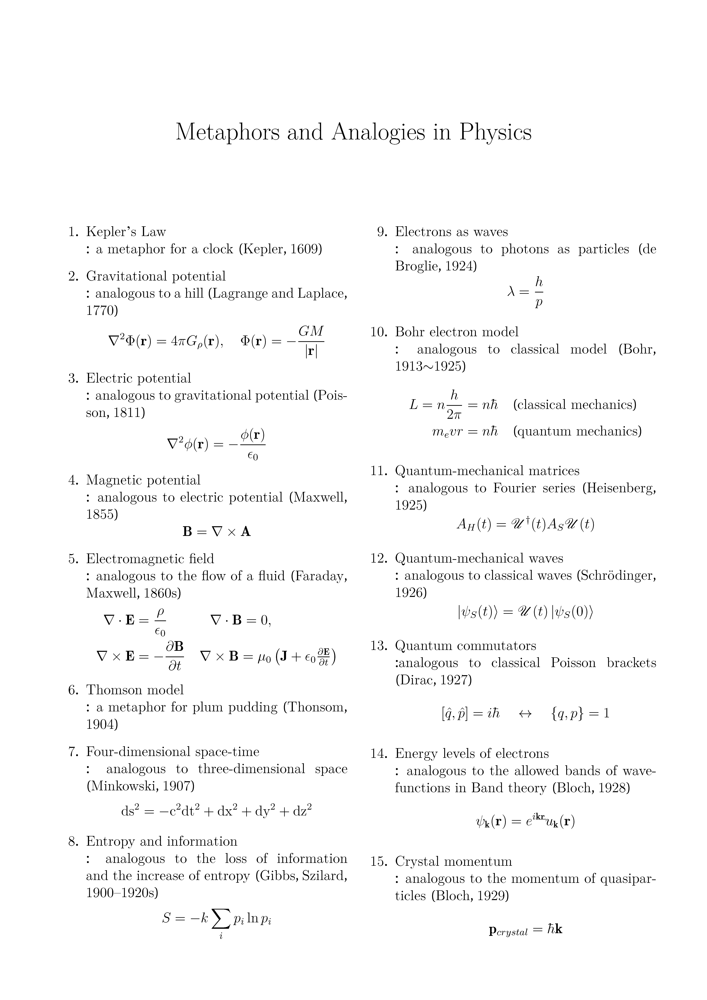
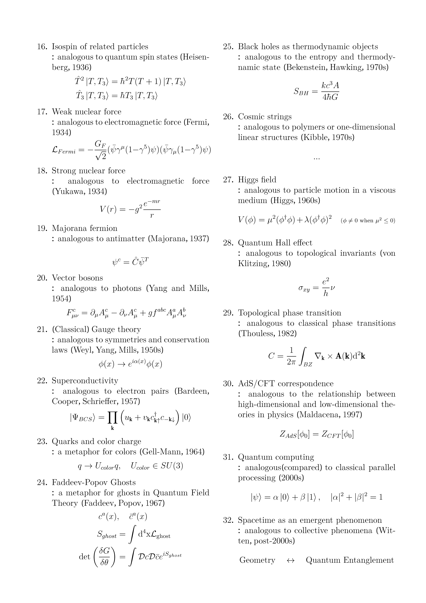

# 과학의 언어

### 같은 것과 다른 것
자기 동일성(self-identity)은 모든 상황에서 항상 참인 진리로, $$X=X$$가 성립합니다. 자연철학자 겸 수학자였던 라이프니츠가 주장한 식별불가능자 동일성 원리(identity of indiscernibles)는 모든 성질이 동일한 두 개체 $X, Y$는 식별불가능하며 이 경우에만 $$X=Y$$가 성립한다는 원칙입니다. 두 식에서 공통적으로 쓰인 '$=$' 라는 기호는 동일한 의미를 가지고 있는 걸까요?    
자연현상을 기술하는 물리학은 자연철학을 계승한 학문입니다. 물리학에서 사용되는 수식에는 항상 참이라고 가정하는 정의나 관계를 기술하는 항등식과 특정 조건에서 성립하여 현상에 대해 구체적인 해를 계산하는 방정식이 있습니다. 두 수식에서 사용되는 등호의 의미는 다르며, 항등식과 방정식을 이루는 기호들은 미묘한 인과관계의 순서에 따라 배열되는 경향이 있습니다. 예를 들어 뉴턴의 제2법칙 $$F=ma$$ 과 시간 의존 슈뢰딩거 방정식 $$i\hbar \frac{\partial}{\partial t}\ket{\Psi(t)}$$ $$=\hat{H}\ket{\Psi(t)}$$에서의 등호의 의미는 다르게 해석되어야 하며, $$F=ma$$가 $$\frac{F}{m}=a$$라고 쓰여지는 경우는 교육적인 목적(혹은 그 외의 의도)으로 설명되는 상황 외에는 거의 없습니다.  

현실에서 '같다'라고 간주되는 것은 논리적 동일성과 동일하지 않으며, 대개 확실성과 추정에 근거하여 어떤 것이 참임을 주장하는 정도를 말할 때가 많습니다. 사람이 기호와 수식의 의미를 학습하는 것은 언어 학습에 언제나 후행하므로 인간 의식을 탐구하려면 사람의 언어 패턴을 유심히 관찰할 필요가 있다고 생각될지 모르겠습니다. 사람은 환경을 관찰할 때 동일성과 차이에 주목하는 경향이 있기에 언어를 사용할 때 겉보기에 같은 기호나 단어를 혼동하게 되는 상황은 매우 많으며, 이것이 소모적인 언쟁과 논쟁의 원인이 될 때도 많습니다. $\text{X는 Y다}$의 형태를 가지는 명제는 경우에 따라 현실에서 은유법으로 사용되기도 하므로 이러한 층위에서부터는 형식논리적 표기가 그다지 유효하지 않을 것입니다.  

### 은유(metaphor)와 유추(analogy)
이 층위를 다루는 개념은 은유와 유추로 알려져 있습니다. 은유란 차이를 가진 한 개념을 해당 개념과 국소적으로 동일성을 가진 다른 개념으로 표현함으로써 새로운 방식으로 이해를 돕거나 정보를 전달하는 기법입니다. 유추란 서로 다른 개념 간의 그러한 유사성을 넘어 구조적, 개념적 연결고리를 찾는 것입니다.  
은유와 유추는 인간 사고의 핵심 메커니즘입니다. 넓은 의미에서의 은유는 어떤 경험이나 영역에 익히 알고 있는 경험이나 영역의 세계를 매핑하는 모든 것을 지칭할 수 있으므로 언어 자체가 거대한 은유로 이루어져 있다고 할 수 있습니다. 유추는 초보적인 학습에서부터 정교하고 체계적인 과학적 발견에 이르기까지 모든 사고 과정에 포함되어 있습니다. 순진한 유추(naive analogy)는 그중 초기 단계의 직관적 비유(비교)를 의미합니다. 복잡한 경험이나 추론 없이 이루어지는 유추이므로 주로 교육학적 관점에서 학생들을 가르치기 위해 '틀린 비유'를 사용하는 경우가 순진한 유추의 예시라 할 수 있습니다.   
은유와 유추 없이 사람은 그 어떤 생각도 소통도 할 수 없습니다. 많은 사람들이 (자기가 지금 유추와 은유를 사용해서 말하고 있다는 것조차 인지하지 못할 정도로) 은유와 유추를 자연스럽게 사용합니다. 과학에서 이것은 모형, 이론, 관측 사이에서 상호작용하는 매개체입니다. 이 도구들은 직관적으로 파악하기 어렵거나 상상 불가능하거나 매우 어려운 개념을 쉽게 이해하는데 도움을 주지만, 그만큼 원본(실재)을 왜곡해 표현합니다. 그럼에도 불구하고 과학에서의 유추는 역사적으로 비일비재하게 사용되어 왔으며 종종 새로운 패러다임을 제시하는 실마리가 됩니다.  

-----
*Surfaces and Essences*, D.Hofstadter

*과학의 언어*, 캐럴 리브스

  <a href="{{ '/List/SM/sm.html' | relative_url }}" class="prev-button">목록</a>

