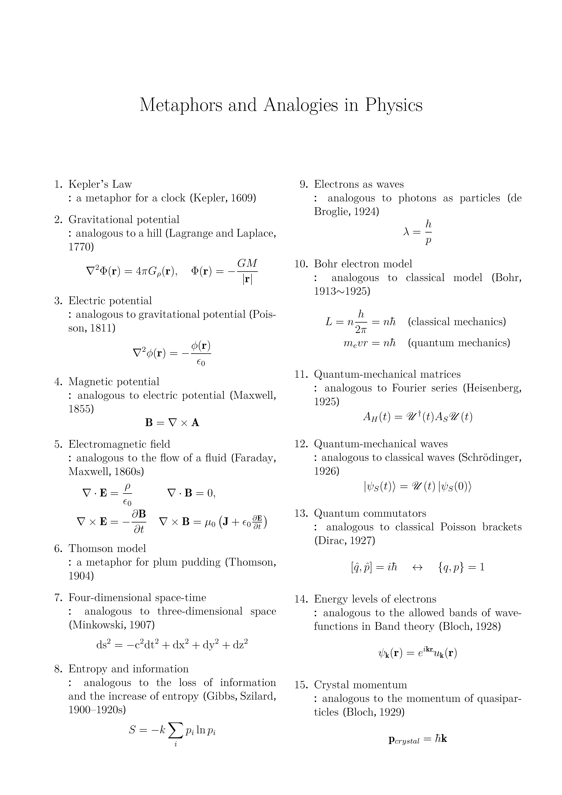
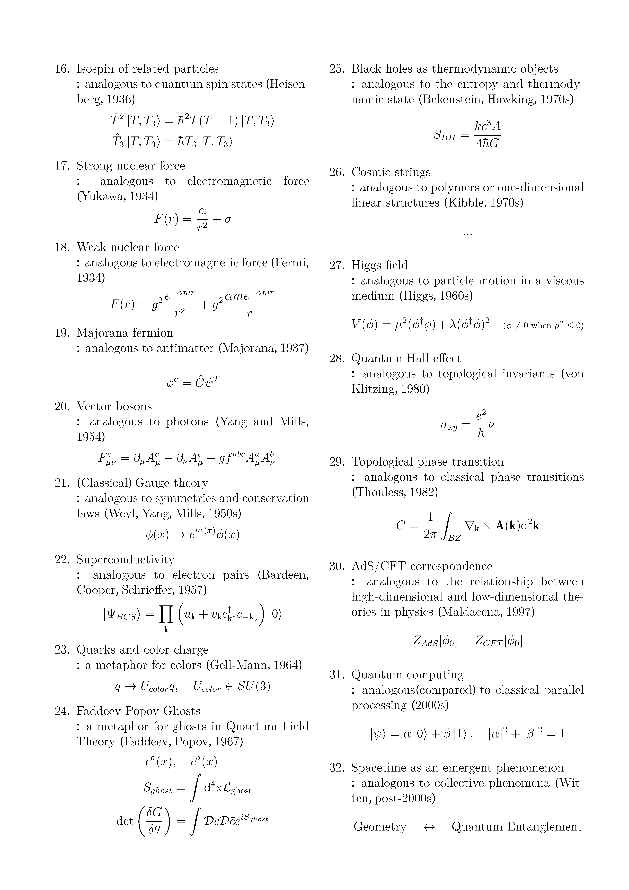

# 과학의 언어

### 은유(metaphor)와 유추(analogy)
은유란 차이를 가진 한 개념을 해당 개념과 국소적으로 동일성을 가진 다른 개념으로 표현함으로써 새로운 방식으로 이해를 돕거나 정보를 전달하는 기법입니다. 유추란 서로 다른 개념 간의 그러한 유사성을 넘어 구조적, 개념적 연결고리를 찾는 것입니다.  
은유와 유추는 인간 사고의 핵심 메커니즘입니다. 넓은 의미에서의 은유는 어떤 경험이나 영역에 익히 알고 있는 경험이나 영역의 세계를 매핑하는 모든 경우를 지칭할 수 있으므로 언어 자체가 거대한 은유로 이루어져 있다고 할 수 있습니다. 유추는 초보적인 학습에서부터 정교하고 체계적인 과학적 발견에 이르기까지 모든 사고 과정에 포함되어 있습니다. 순진한 유추(naive analogy)란 그중 초기 단계의 직관적 비유(비교)를 의미합니다. 복잡한 경험이나 추론 없이 이루어지는 유추이므로 주로 교육학적 관점에서 학생들을 가르치기 위해 '틀린 비유'를 사용하는 경우가 순진한 유추의 예시라 할 수 있습니다.   
은유와 유추가 없다면 사람은 그 어떤 생각도 소통도 할 수 없습니다. 많은 사람들이 (스스로 유추와 은유를 사용해서 말하고 있다는 것조차 인지하지 못할 정도로) 은유와 유추를 자연스럽게 사용합니다. 과학에서 이것은 모형, 이론, 관측 사이에서 상호작용하는 매개체입니다. 이 도구들은 직관적으로 파악하기 어렵거나 상상 불가능하거나 매우 어려운 개념을 쉽게 이해하는데 도움을 주지만, 그만큼 원본(실재)을 왜곡해 표현합니다. 그럼에도 불구하고 과학에서의 비유법은 역사적으로 비일비재하게 사용되어 왔으며 종종 새로운 패러다임을 제시하는 실마리가 되기도 했습니다. 닐스 보어는 이러한 언어의 특징을 다음처럼 시사한 바가 있습니다. *"어떤 진실을 이야기하고자 할 때, 우리는 그 진실에 정확히 부합하지 않는 상과 비유로 이야기할 수밖에 없다. 때로는 모순을 결코 피할 수 없다. 하지만 바로 그런 표상들이 우리로 하여금 진실에 가장 가까이 다가갈 수 있게 한다."*  
이곳에서는 약 32가지의 리스트를 예시로 제시하였습니다. (추후 수정 예정)   

-----
*Surfaces and Essences*, D.Hofstadter

*과학의 언어*, 캐럴 리브스

  <a href="{{ '/List/SM/sm.html' | relative_url }}" class="prev-button">목록</a>

