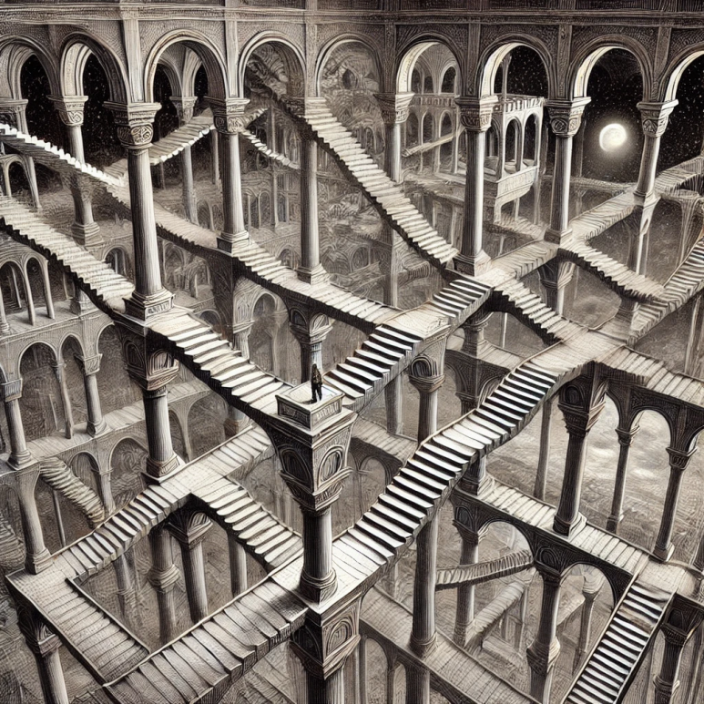

# 어느 날의 꿈 2

내가 사는 곳은 어디지?

내가 상상하는 것이 현실이고 내가 현실이라고 생각했던 곳이 하룻밤의 꿈에 지나지 않으며 나는 기나긴 악몽을 꾸고 있을 뿐이라고 생각하지 말아야 하는 이유가 있나?

내가 현실을 마주하는 시간보다 상상 속의 공간에 머무르는 시간이 중요하다면 상상 속이야말로 나의 마음의 고향이 아닌가.

내 고향은 이데아였고 나는 우주를 떠돌던 나그네였다.

  <a href="{{ '/List/SM/sm.html' | relative_url }}" class="prev-button" data-turbo="true">목록</a>

