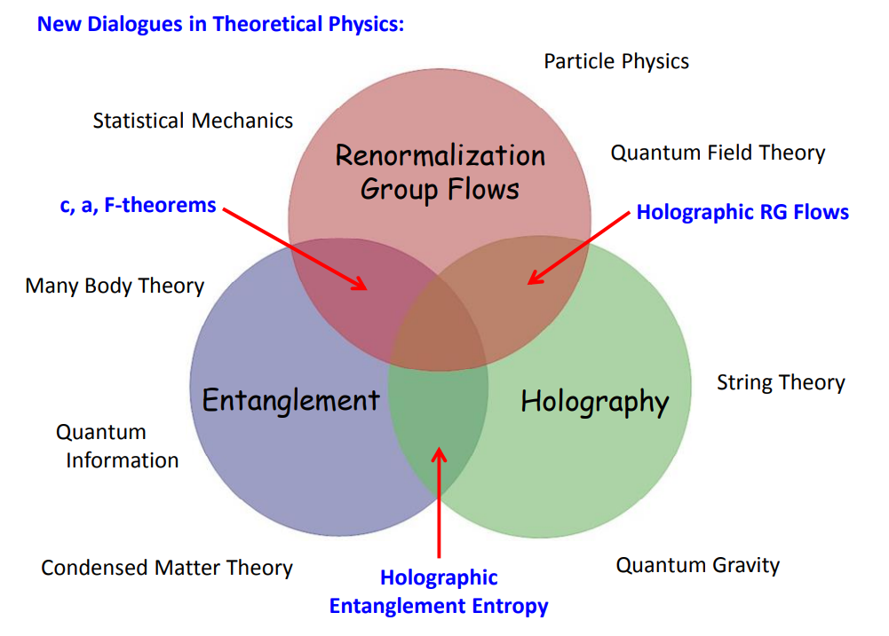
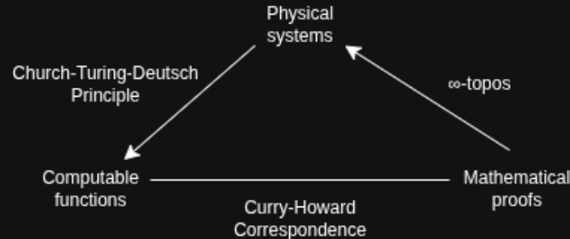
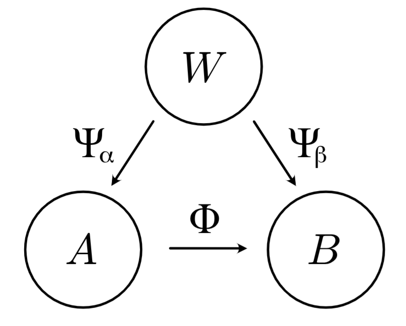
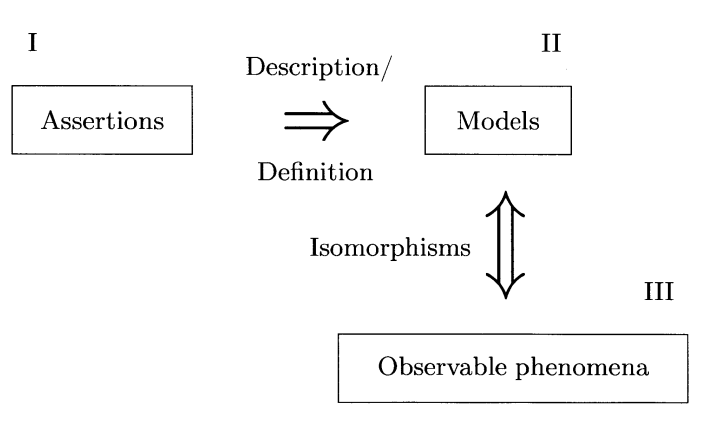
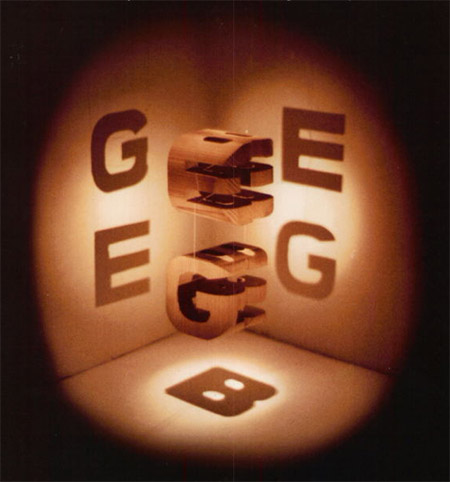
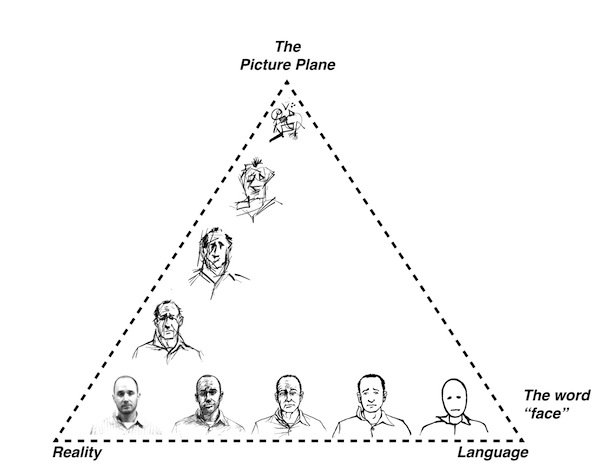
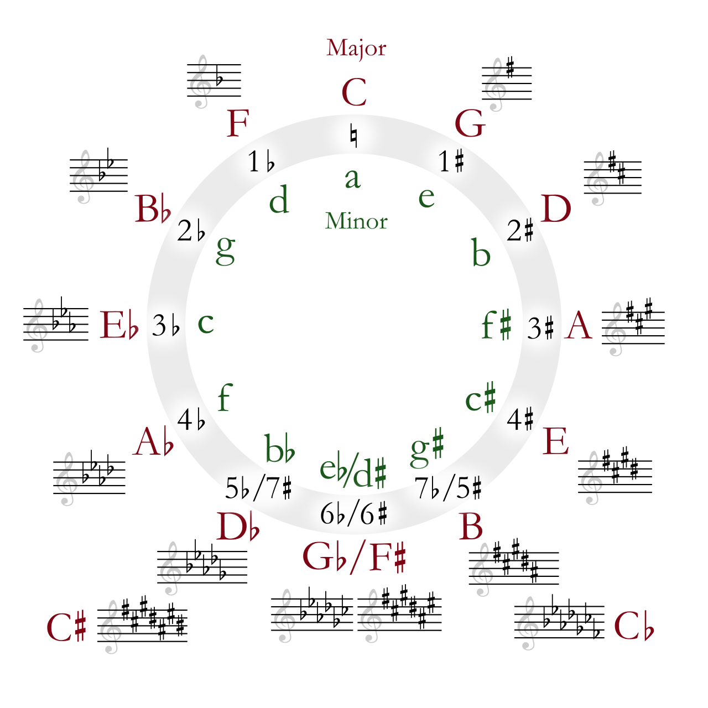
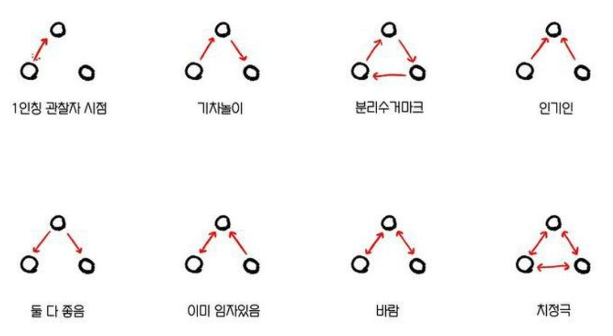

# 기묘한 삼각관계

\: [New Dialogues in theoretical physics](https://public.websites.umich.edu/~mctp/SciPrgPgs/events/2012/rgflows/talks/Myers-intro12.pdf)

  
\: The trinity (christian trinitarianism)

\: [The computational trinitarianism](https://home.sandiego.edu/~shulman/papers/trinity.pdf)

\: [The Rosseta stone](https://ncatlab.org/nlab/show/computational+trilogy)(Differential cohomology in a cohesive (infinity,1)-topos)

\: [Relations between the spaces of states of the world, the microscopic theory, and the macroscopic theory](https://arxiv.org/pdf/2410.15468)

\: The semantic view of scientific theory

  
\: Strange loop(Bach's riddle canon, Escher's arts, Godel's incompleteness theorems) by Douglas Hofstadter

\: Three functions of images by Scott Mccloud

\: Javascript trinity

\: [Circle of fifths](https://en.wikipedia.org/wiki/Circle_of_fifths)

\: 통상적인 삼각관계 유형들..

  <a href="{{ '/List/SM/sm.html' | relative_url }}" class="prev-button" data-turbo="true">목록</a>

