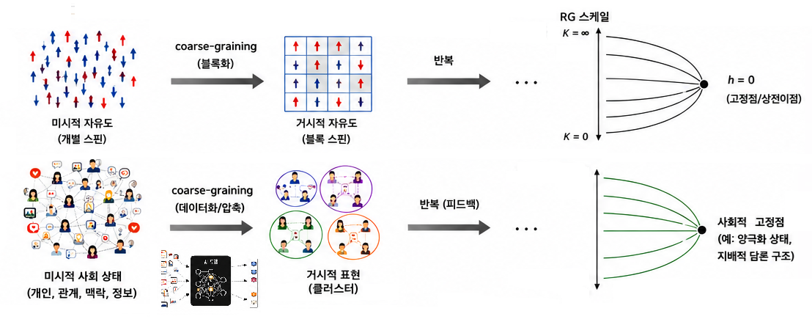
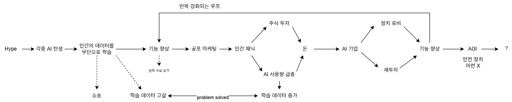

# AI는 세계를 coarse-graining하는 재규격화 체계이다

\: 세상의 어떤 정보는 보존되고, 어떤 정보는 버려진다

- 자본주의 시장에서 이윤 창출을 위해 AI 기업들은 더 많은 데이터를 확보하고 더 큰 파라미터를 가진 모델을 만들기 위해 무한 경쟁을 벌이고 있음
- 개인의 선택이나 거부만으로는 제어 불가능한 수준

---

[AI as social technology](https://knightcolumbia.org/content/ai-as-social-technology?utm_source=substack&utm_medium=email)

  <a href="{{ '/List/SM/sm.html' | relative_url }}" class="prev-button" data-turbo="true">목록</a>

